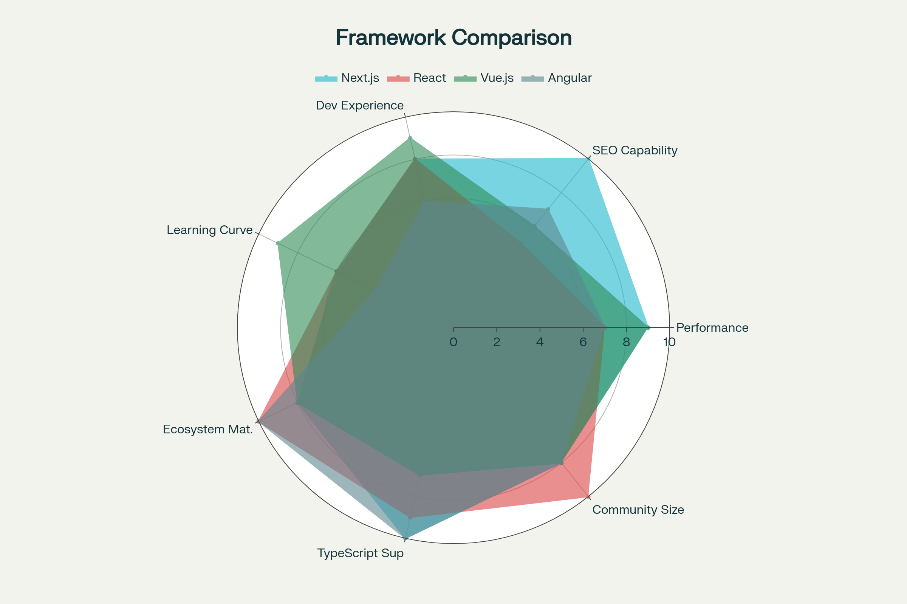

# Technical State of the Art: Next.js Web Client for AREA Automation Platform

For the AREA project's web client implementation, **Next.js emerges as the optimal choice** due to its hybrid rendering capabilities, built-in SEO optimization, excellent TypeScript integration, and seamless authentication handling through NextAuth.js. The framework's server-side rendering (SSR) and static site generation (SSG) capabilities provide significant advantages for an automation platform that requires both marketing pages for user acquisition and dynamic application interfaces for service configuration. While React, Vue.js, and Angular each offer compelling features, Next.js provides the most comprehensive out-of-the-box solution that aligns with the AREA project's requirements for REST API communication, OAuth2 authentication, and responsive user interfaces.

## Framework Landscape and Classification

### Next.js: The Full-Stack React Meta-Framework
Next.js represents the evolution of React development, transforming from a UI library into a complete full-stack framework. Built by Vercel and officially supported by the React team, Next.js has become the de facto standard for production React applications in 2025. It provides hybrid rendering strategies—SSR, SSG, ISR, and CSR—and features file-system routing, incremental static regeneration, and rapid development velocity.

### React: The Foundation Library
React remains the most widely adopted UI library globally, with a massive ecosystem and extensive corporate backing. As a library, React requires developers to assemble their own technology stack for routing, state management, and data fetching. It excels for SPAs, but achieving optimal SEO and SSR requires Next.js or other meta-frameworks.

### Vue.js: The Progressive Framework
Vue.js is praised for its simplicity and learning curve, component-based architecture, lightweight bundle size, and excellent performance in DOM manipulation. Vue's two-way data binding and reactivity system simplify state management, although SSR requires Nuxt.js.

### Angular: The Enterprise-Grade Framework
Angular is a fully-featured, opinionated framework built on TypeScript, favoring structural consistency and enterprise-scale applications. It leverages dependency injection, RxJS for state management, and Ahead-of-Time (AOT) compilation for optimal performance, but has a steeper learning curve.

### Laravel: The Backend Counterpoint
Laravel, as a backend PHP framework, provides robust API construction but cannot match the dynamic UI capabilities of JavaScript frameworks like Next.js. The typical architecture pairs Laravel as a backend API with a JS frontend.

---

## Comparative Table: Framework Features

| Framework | Type | Primary Language | Architecture | Learning Curve | SEO Capability | Bundle Size | Routing | State Management | TypeScript Support |
|---|---|---|---|---|---|---|---|---|---|
| Next.js | Full-Stack React | JS/TS | Hybrid SSR/SSG/CSR | Moderate | Excellent (SSR) | 87KB | File-based | Context/Zustand/Redux | Native |
| React | UI Library | JS/TS | Component | Moderate | Requires setup | Variable | React Router | Redux/Zustand/Recoil | Excellent |
| Vue.js | Progressive | JS/TS | Component | Easy | Good (Nuxt.js) | 18-21KB | Vue Router | Vuex/Pinia | Good |
| Angular | Complete | TS | MVC+DI | Steep | Good | Large | Built-in | RxJS/Services | Native |
| Laravel | Backend | PHP | MVC | Moderate | N/A | N/A | Eloquent | Eloquent ORM | Limited |

---

## Framework Performance – Core Web Vitals Comparison

[Performance comparison across major frontend frameworks showing initial load time, navigation speed, and Largest Contentful Paint (LCP) metrics.]

---

## Multi-Dimensional Comparison: Radar Chart

[Multi-dimensional comparison of Next.js, React, Vue.js, and Angular across key development and performance characteristics.]

---

## AREA Project Requirements Versus Framework Capability

| Requirement                       | Next.js Capability                       | React Capability                          | Vue.js Capability                            | Recommended |
|------------------------------------|------------------------------------------|-------------------------------------------|-----------------------------------------------|-------------|
| User Registration & Auth           | Excellent (API routes + forms)           | Good (extra setup)                        | Good (Vue Router + API)                       | Next.js     |
| OAuth2 Integration                 | Excellent (NextAuth.js)                  | Good (Auth0/custom)                       | Good (Social Auth/custom)                     | Next.js     |
| REST API Communication             | Excellent (fetch + TS types)             | Good (Axios/manual)                       | Good (Axios)                                  | Next.js/React|
| Service Subscription Management    | Good (state + server validation)         | Good (state lib)                          | Good (Vuex/Pinia)                             | Next.js     |
| Action/REAction Configuration UI   | Excellent (dynamic forms/React comp)     | Excellent (SPA components)                | Excellent (SFCs)                              | Any         |
| Real-time Updates                  | Good (WebSocket + React Query)           | Good (WebSocket+state)                    | Excellent (reactivity)                        | Vue/React   |
| Responsive Design                  | Excellent (CSS Modules/Tailwind)         | Excellent                                 | Excellent (scoped styles)                     | Any         |
| Accessibility (WCAG)               | Good (semantic HTML/ARIA)                | Good                                      | Good                                          | Any         |
| Form Handling                      | Excellent (React Hook Form)              | Excellent                                 | Excellent (v-model)                           | Next.js/Vue |
| State Management                   | Excellent (Context/Zustand/Redux)        | Excellent (Redux/Zustand)                 | Excellent (Vuex/Pinia)                        | Any         |
| SEO (Marketing Pages)              | Excellent (SSR/SSG)                      | Poor (CSR only)                           | Needs Nuxt.js                                 | Next.js     |
| Performance                        | Excellent (auto optimize)                | Good (manual)                             | Excellent (lightweight)                       | Next.js/Vue |

---

## Next.js Strengths and Weaknesses Analysis

| Category    | Aspect              | Description                                               | Impact  |
|-------------|---------------------|-----------------------------------------------------------|---------|
| Strengths   | Hybrid Rendering    | Supports SSR, SSG, ISR, CSR per page                      | High    |
| Strengths   | SEO Optimization    | Server-side rendering offers excellent SEO                | High    |
| Strengths   | Performance         | Code splitting, lazy loading, LCP < 2.5s                  | High    |
| Strengths   | Developer Experience| Fast Refresh, zero-config, great docs, Vercel integration | High    |
| Strengths   | File-based Routing  | Intuitive, eliminates manual config                       | Medium  |
| Strengths   | Image Optimization  | \<Image> component, automatic WebP, lazy load             | Medium  |
| Strengths   | API Routes          | Serverless API endpoints inside app                       | High    |
| Strengths   | TypeScript Support  | First-class support, auto-completion                      | High    |
| Weaknesses  | Learning Curve      | More conceptually complex than React                      | Medium  |
| Weaknesses  | Opinionated         | Conventions can feel restrictive                          | Medium  |
| Weaknesses  | Vendor Lock-In      | Strong Vercel ties, self-hosting possible                 | Low     |
| Weaknesses  | Build Complexity    | Larger projects face slower builds without caching        | Medium  |
| Weaknesses  | Middleware Limits   | Edge runtime constraints limit Node.js API for middleware | Low     |

---

## Charts

Performance Comparison:
[77]

Radar Comparison:
[78]

---

## Conclusion and Recommendation

After comprehensive analysis, **Next.js is recommended** for the AREA platform's web client, offering the best balance of hybrid rendering, SEO, developer efficiency, TypeScript support, and integrated authentication. Vue.js remains an attractive alternative for lower learning curve and lightweight projects, but for complex automation and marketing-driven platforms, Next.js excels.

---